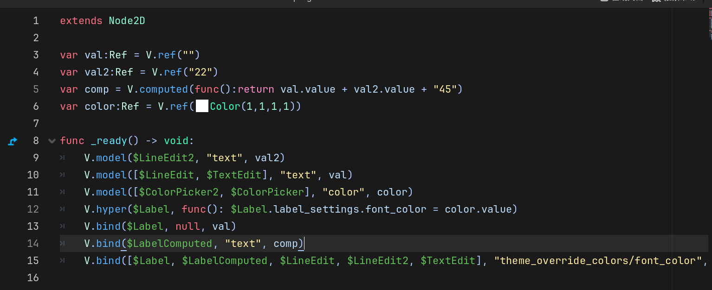
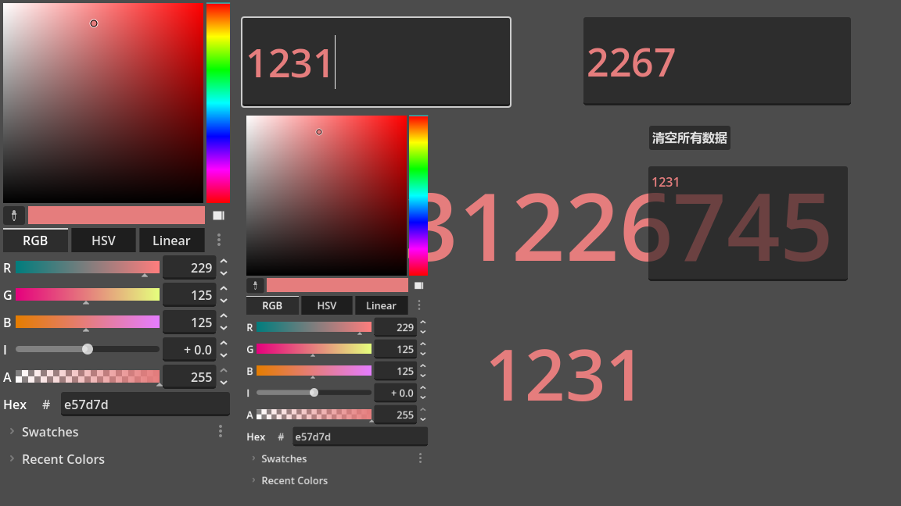

# Vuedot

> 像 Vue 一样轻松管理 Godot 节点与数据

Vuedot 是一个 Godot 4 编辑器插件，将 Vue.js 风格的响应式数据绑定引入 Godot 引擎。通过响应式引用（Ref）、计算属性（Computed）、双向绑定（Model）等原语，让 UI 节点与数据之间的同步变得简洁而直观。

## 特性

- **响应式数据** — `ref()` 创建响应式引用，`computed()` 派生计算属性，数据变化自动触发 UI 更新
- **节点绑定** — `bind()` 单向绑定（数据 → 节点属性），`model()` 双向绑定（类似 Vue 的 v-model）
- **副作用管理** — `hyper()` 在节点生命周期内运行副作用，节点销毁时自动清理
- **变化监听** — `watch()` 监听数据变化并获取新旧值对比
- **弱引用安全** — 依赖追踪使用弱引用，避免内存泄漏

## 快速开始

### 安装

1. 将 `addons/vuedot` 目录复制到你的 Godot 项目的 `addons/` 下 或 在Godot 资源库搜索Vuedot安装
2. 在项目设置 → 插件中启用 **Vuedot**

### 基础用法

```swift
# 创建响应式数据
var message: Ref = V.ref("Hello")
var count: Ref = V.ref(0)
var greeting = V.computed(func(): return message.value + " World")

# 单向绑定：数据变化 → UI 自动更新
V.bind($Label, "text", message)

# 双向绑定：数据 ↔ 输入控件（类似 v-model）
V.model($LineEdit, "text", message)

# 副作用：节点存在期间自动运行，节点销毁时自动清理
V.hyper($Label, func():
    $Label.modulate = Color.RED if count.value < 0 else Color.WHITE
)

# 监听变化
V.watch(self, message, func(old_val, new_val):
    print("消息从 ", old_val, " 变为 ", new_val)
)
```

完整的示例场景请查看 `addons/vuedot/example/` 目录。

## API 参考

| 方法 | 说明 |
|---|---|
| `V.ref(initial_value)` | 创建响应式引用，读取 `.value` 时收集依赖，写入 `.value` 时派发更新 |
| `V.computed(getter)` | 创建计算属性，依赖的 ref 变化时自动重新计算 |
| `V.bind(node, prop, ref)` | 单向绑定：ref 值变化 → 自动设置节点属性。支持批量节点/属性 |
| `V.model(node, prop, ref)` | 双向绑定：支持 LineEdit、TextEdit、ColorPicker 等控件 |
| `V.hyper(node, fn)` | 在节点生命周期内运行副作用函数，节点退出场景树时自动停止 |
| `V.on(node, signal, fn)` | 监听节点信号 |
| `V.watch(node, ref, callable)` | 监听 ref 变化，回调接收 (old_value, new_value) |
| `V.clean(effect)` | 手动停止一个副作用 |

> 所有方法也可通过 `Vue.xxx()` 调用（`Vue` 是 `V` 的别名）。

## 示例

| 示例 | 路径 | 说明 |
|---|---|---|
| Simple | `addons/vuedot/example/Simple.tscn` | 展示 ref、computed、bind、model、hyper 的基础用法 |
| Hero | `addons/vuedot/example/Hero/Hero.tscn` | 完整案例：英雄列表、选中联动、随机添加 |





## 架构

```
addons/vuedot/
├── api/
│   ├── api.gd        # 核心 API 实现（响应式绑定、副作用管理）
│   ├── v.gd           # 公开 API（V 类）
│   └── Vue.gd         # Vue 别名
├── reactive/
│   ├── ref.gd         # 响应式引用（Ref）
│   ├── effect.gd      # 副作用（Effect）
│   └── dep.gd         # 依赖收集与派发（Dep）
├── example/
│   ├── Simple.gd/tscn # 基础示例
│   └── Hero/          # 英雄列表示例
├── plugin.cfg         # 插件配置
└── vuedot.gd          # 插件入口
```

### 响应式原理

1. **Ref** — 包装一个值，通过 `.value` 的 getter/setter 拦截读写。读取时调用 `Dep.depend()` 收集当前活跃的 Effect；写入时调用 `Dep.notify()` 通知所有订阅者重新执行
2. **Effect** — 包装一个函数，执行前将自己设为全局活跃 Effect，执行过程中所有被读取的 Ref 都会将其注册为依赖
3. **Dep** — 每个 Ref 持有一个 Dep 实例，维护订阅者列表，负责依赖收集和更新派发

## 环境要求

- Godot 4.1+
- 支持 Forward+ 和 Jolt Physics（示例项目配置）

## 许可证

MIT © 2026 ATAO (LiuYT2103)
